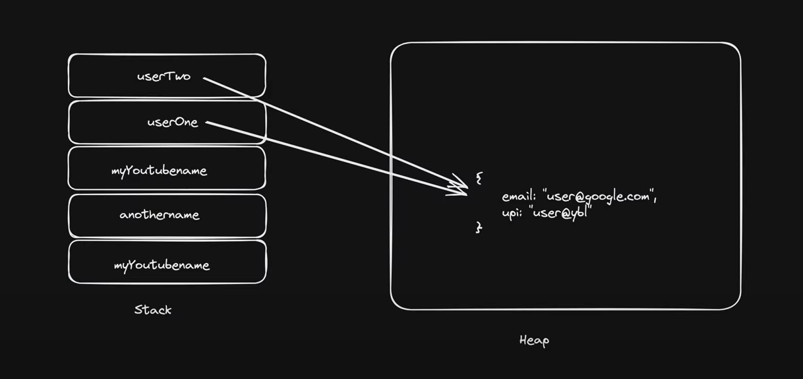

# Lession 1

-> NodeJS is an environment used to run the JS files ( you can also use Deno )

# Lession 4 ( Variables )

-> Mota Mota try to avoid using var ( scope mein antar ni janta wo so agar block ya functional scope mein same variable galti se change kar diya to har jagah change ho jaega)
-> const ko declare karke initialise karna bhi zaruri hai
-> let ko sirf declare kar sakte ( uski value undefined hogi)
-> Let ko tum ek normal variable maan sakte ho jaise baaki lang mein hota hai

# Lession 5 ( Datatypes )

-> primitive (non referenced -> immutable ) (7 hote hai unke alawa koi bhi aur) non primitive ( reference wale -> mutable)
-> null vs undefined
-> typeof -> data type batata hai us particular varibale ka
-> Interview Question ( typeof null vs undefined )
-> typeof null object return kar deta hai ( jo ki non primitive hai ye kyun???)

    Why typeof null Returns "object" in JavaScript?

    The typeof null returning "object" is a long-standing bug in JavaScript that dates back to the language's early days. It was never fixed because fixing it would break many existing websites that rely on this behavior.

    The Historical Reason
    In the first version of JavaScript (1995), values were stored in 32-bit units:

# The first 3 bits indicated the TYPE TAG

    000 → object

    1 → integer

    010 → double (floating-point)

    100 → string

    110 → boolean

# null was represented as all zeros (00000000...), which matched the object tag (000).

# Thus, typeof null incorrectly returned "object".

    Why Wasn’t It Fixed?
    Backward Compatibility: Many existing websites and scripts relied on this behavior.

    Breaking Changes: Fixing it would cause many programs to fail unexpectedly.

    ECMAScript Spec Acknowledges It:
    The ECMAScript specification explicitly states:

    "The typeof operator returns "object" for null for legacy reasons."

    How to Properly Check for null?
    Since typeof null is misleading, the best way to check for null is:

    const value = null;

    // Correct way:
    console.log(value === null); // true

    // Wrong way (due to the bug):
    console.log(typeof value === "object"); // true (misleading)

# Lession 5 ( Conversion  )

-> NaN is of type Number
-> Boolean mein agar data ya 1 hai to true otherwise false
-> string mein jo doge wo convert ho jaega as it is
-> lekin object ko direct convert karoge to [object Object] aega to use JSON.stringify()

# Lession 5 ( Operations )

-> Math.floor(x/y) or Math.trunc(x/y) for quotient
-> floor gives you the floor as it suggest for neg numbers ( like -3.4) would be -4 but for trunc it will be -3, so use trunc for negatives
-> log("1"+2+3) vs log(1+2+"3")
-> Operator precedance time mile kabhi to padhna

Top 7 Operator Precedence Rules
Precedence	Operator(s)	        Example	            Associativity	Key Behavior
1           () (Grouping)	    (2 + 3) * 4	    →	Highest priority, always first
2	        ** (Exponent)	    2 ** 3 ** 2	    ←	Right-to-left: 2 ** (3 ** 2)
3	        * / %	            3 * 4 / 2 % 3	→	Left-to-right (equal precedence)
4	        + -	                5 + 3 - 1	    →	Left-to-right (equal precedence)
5	        > < >= <=	        5 > 3 === true	→	Comparisons happen before ==
6	        && (Logical AND)	`a && b		c`	→	Higher than ||
7	        = (Assignment)	    a = b = 5	    ←	Right-to-left (chains work)

# Lession 6 ( Comparison )

-> Basic comparison
-> Jab different type ko karo to make sure dono ko same type mein le ao ( like string > int ko ya to int > int karo ya fir str > str karo)
-> null ka comparison zero se

Expression	Result	Why?
null > 0	false	null → 0 (numeric), but 0 > 0 is false.
null == 0	false	null only equals undefined (null == undefined → true) in loosed equality
null >= 0	true	null → 0 (numeric), and 0 >= 0 is true.
null === 0	false	No type coercion; null (object) ≠ 0 (number).

Numeric comparisons (>, <, >=, <=):

null → 0 (null converts to zero ).

Loose equality (==):

null == undefined → true.

null == 0 → false (no numeric coercion here!).

Strict equality (===):

Always checks type + value → null is an object, not a number.

Mere notes

> , < ,>= ,<=  ismein null ko convert karenge in zero then check
== (lose equality) ismein null ko check karte hai undefined se 
=== (strict equality) ismein to type se check hota (object)!=number

Similarly  undefined convert hota hai NaN mein to sabhi conditions false hongi

## lekin undefined==null ( this is true)

-> strict checks

# Lession 7 ( Datatypes Summary)

->  Two Data Type Categories in JavaScript
JavaScript data types are categorized into 2 types based on how they are stored and accessed in memory:

Primitive (Call by Value)

Non-Primitive (Call by Reference)

-> Primitive Data Types (7 Types)
Stored directly in memory (copied when assigned).

Types: Number, String, Boolean, Null, Undefined, Symbol, BigInt.

Example Quirk:

javascript
const id1 = Symbol('123');
const id2 = Symbol('123');
console.log(id1 === id2); // false (unique symbols)
->  Non-Primitive Data Types (Reference Types)
Stored as references (changes affect all copies).

Types: Array, Object, Function, Date, RegExp.

-> JavaScript is Dynamically Typed
Types are checked at runtime (not compile time).

Variables can change types freely:

javascript
let x = 10;      // number  
x = "hello";     // string  
x = true;        // boolean  
-> Static Typing via TypeScript
TypeScript adds static typing (compile-time checks) to JavaScript.

Example:

typescript
let y: number = 10;  
y = "hello"; // Error (TypeScript prevents this).  
Key Takeaway:

Primitive = Copy | Non-Primitive = Reference.

JS flexibility = Dynamic Typing.

TypeScript = Optional Static Typing.

-> Return type of variables in JavaScript

1) Primitive Datatypes
       Number => number
       String  => string
       Boolean  => boolean
       null  => object
       undefined  =>  undefined
       Symbol  =>  symbol
       BigInt  =>  bigint

2) Non-primitive Datatypes
       Arrays  =>  object
       Function  =>  function
       Object  =>  object

# Lession 8 ( Stack and Heap Memory )

-> Stack hold primitive data types 
-> Heap non primitive ( reference copy hota hai ek varibale change karoge to doosra bhi change hoga)

-> Ek note 
    Stack mein wo variable to jaega lets say object wala bas value ki jagah reference ko point karega example ni samjhe to (memory wala dekh lo)

    

# Lession 9 ( Strings )

-> String interpolation allows embedding variables/expressions directly into strings using template literals (enclosed in backticks `).
-> substring cant be used for negative indices use slice instead
-> All methods return a new string (original remains unchanged). ( Immutability )

# Lession 10 ( Nums and Maths )

-> Normal Functions 

# Lession 11 ( Date and Time )

-> Basic date and time functions

# Lession 12 ( Arrays )

-> All built-in array-copy operations (spread syntax, Array.from(), Array.prototype.slice(), and Array.prototype.concat()) create shallow copies. If you instead want a deep copy of an array, you can use JSON.stringify() to convert the array to a JSON string, and then JSON.parse() to convert the string back into a new array that's completely independent from the original array.

-> Shallow means reference same hoga agar ek mein change kiya to doosra bhi change ho jaega
-> Deep copy mein alag alag reference hai to standalone array banega doosra

-> slice vs splice (splice alters the ori array while slice doesn't)

-> shift aur unshift ( naam ke viprit kaam karte (shift removes from beginning,unshift adds))

# Lession 13 ( Arrays 2)

-> Add one array to other
  -> use simple push and then flat(depth) kitne depth tak jana hai see example ( default 1)
  -> use concat ( can only add one array to another )
  -> (Best way) use spread operator 
-> Making array from iterables
  -> use Array.from() ( An iterable (like String, Array, Map, Set )
  -> use Array.of()  ( set of values )
-> if you want to have objects in the array
  -> then either you can get keys Array.from(Object.key(obj))
  -> or you can get values Array.from(Object.values(obj))
  -> one more thing it will place the [key,value] pair as an array in the other array see example
  Array.from(Object.entries(obj))

  # Lession 14 ( Objects 1)

  -> Two ways we can create object ( using constructor ( singleton object would be created) and literal)
  -> can access keys using . or ['key_name']
  -> to use symbol as a key create a symbol using Symbol() and its key would be under [mySymbol] and to access it object_name[mySymbol]

  ->if you want to freeze changes  Object.freeze(JsUser)

  -> If a function is there in any object you can use this keyword to access all the other fields of objects

  # Lession 15 ( Objects 2 )

  -> Merge objects easily using spread operator
  -> U can also use Object.assign wo ni padha maine
  -> Get array of keys using Object.keys(object_name)
  -> get aray of values using Object.values(object_name)
  -> get array of key value pair Object.entries(object_name)

  -> if you want to check if certain property is there in the object or not use object_name.hasOwnProperty('key')

  -> object destructuring {x,y,z,..}=object_name
  where (x,y,z,.. are the properties of object)

  # Lession 16 ( Functions )

  -> functionname is the reference
  -> functionname() is the function call
  -> function hello(x,y)   hello(a,b)  {x,y => parameters and a,b => arguments}
  -> agar parameter main value dal diya hai explicitly to wo le elga jaise hello(name='areeb') agar ni paas karte kuch to areeb le lega
  -> function ke andar function return bhi kar sakte ho
  -> use ... ( rest operator ) when not sure about the number of parameters
  # Lession 17 ( Scopes )

  Feature
              var	            let	             const
Scope	        Function	      Block	           Block
Hoisting	    Yes (undefined)	Yes (TDZ)	       Yes (TDZ)
Reassignment	✅ Yes	        ✅ Yes	          ❌ No
Redeclaration	✅ Yes	        ❌ No	          ❌ No
Use Case	    Legacy code	    Mutable variables	Constants

-> Ek important note var function scoped hai iska agar wo kisi function ke andar hai tab to bahar access ni hoga lekin agar kisi aur cheez ke andar jaise loops , {} tab accessible hoga

-> Basic functional scopes 
-> Hoisting intro ( Can access functions before initialization but not variable)

var is Function-Scoped (not Block-Scoped)

Variables declared with var are only scoped to functions, not to blocks ({}, if, for, while, etc.).

If var is inside a function, it cannot be accessed outside.

If var is inside a block (but not a function), it can be accessed outside.

Examples:

✅ Case 1: var Inside a Function (Not Accessible Outside)
javascript
function test() {
    var x = 10; // Function-scoped
    console.log(x); // 10 (works inside)
}
test();
console.log(x); // ReferenceError: x is not defined (cannot access outside)
✔️ Correct: var is trapped inside the function.

❌ Case 2: var Inside a Block (Accessible Outside)
javascript
if (true) {
    var y = 20; // Not block-scoped (leaks outside)
    console.log(y); // 20 (works inside)
}
console.log(y); // 20 (still accessible outside!)
⚠️ Problem: var ignores block scope ({}, if, for, etc.) and leaks outside.

❌ Case 3: var in a Loop (Leaks Outside)
javascript
for (var i = 0; i < 3; i++) {
    console.log(i); // 0, 1, 2
}
console.log(i); // 3 (still accessible outside the loop!)
⚠️ Problem: i leaks outside the loop (unlike let/const).

Block Scope (let, const)
Variables declared with let/const are block-scoped.

They are only accessible inside the block ({}) where they are declared.

They do NOT leak outside blocks (if, for, while).

Simple sa ye yaad rakho 

-> let and const are block scoped ({}) iske andar hi accessible hai
-> var is function scoped ( agar sirf function mein hoga to not accessible ousidee) otherwise sabmein hoga

# Lession 18 ( Arrow and This )

-> Browser mein log(this)  will return window Object which is the Global Object ( which acts as a container for all the variable declared globally )
-> in node environment {} 
-> this points to the current context ( obect mein this.key access kar sakte ho lekin this.var_name in function undefined degaa )
-> Why do we use this in normal functions and not in arrow function? ( dekha tha maine to function mein bahut kuch a rha tha , arrow mein ni aya sirf {} aya ( wo is liye kyun uska immediate parents scope was global scope ( node mein tha isliye {} aya browser mein hota to window ata)))

Simple answer hai normal mein they have their own binding is liye usmein ata hai wo sab data, lekin arrow func mein khud ki koi binding ni hoti hai isliye wo this keyword immediate parent ke scope ko refer karta hai ....

Learn more

The this keyword behaves differently in normal functions compared to arrow functions. Normal functions have their own this binding, which is determined by how the function is called (e.g., as a method, via new, call, apply, or bind).
 This allows the this value to be dynamically set based on the context of the call.

In contrast, arrow functions do not have their own this binding.
 Instead, they inherit the this value from the enclosing (lexical) scope where they are defined.
 This means that this inside an arrow function refers to the this value of the nearest non-arrow parent function or the global object if no such parent exists.

 # Lession 19 ( IIFE )

->In JavaScript, when you declare variables or functions without any protection, they automatically become part of the global scope (usually the window object in browsers). This leads to global namespace pollution, which can cause:
->Naming Collisions – If two scripts use the same variable name, they overwrite each other.
->Memory Leaks – Unused variables stay in memory because they’re globally accessible.
->Unpredictable Bugs – Other scripts can accidentally modify your variables.

How IIFE Solves This?
-> An IIFE creates a private scope where variables are confined inside the function and disappear after execution.

// standard IIFE
(function () {
  // statements…
})();

// arrow function variant
(() => {
  // statements…
})();

// async IIFE
(async () => {
  // statements…
})();

-> Named IIFE ( functional one) and Normal IIFE arrow function
-> We can use multiple iife just remember to add semi colon ( that can be anywhere before the start of the other function) 
-> In our code example I have taken one after the other ( lekin man lo doosra wala hazaar line ke baad hota lekin agar kahin bhi ; a jega to cancel ho jaega wo lekin hn dhyan rakhna ki semicolon turant laga do call hone ke just baad ()(); )

# Lession 20 ( Execution Context and Call Stack)

## Everything in JS happens inside an execution context

## JavaScript is synchronous single threaded language

->An Execution Context is the environment where JavaScript code runs, consisting of:

Variable Environment (hoisting, scope).

Scope Chain (access to outer variables).

this Binding (context-dependent).

It is created in two phases (Memory Allocation → Execution) and managed via the Call Stack.

-> For In depth look at the code

# Lession 21 ( Control Flow )

-> If you dont add break it will execute all the staments below it till it finds next break it can even execute default

-> So, inside a switch statement, once a case statement matches the given variable, all following statements will be executed ignoring the criteria until a break statement or closing curly bracket is encountered

-> default can be placed anywhere

-> Truthy values and Falsy Values

-> Learn falsy values 

false, 0 ,-0,BigInt 0n,"",null,undefined,NaN

-> Nullish Coalescing Operator (??)

-> // || drops falsy value

