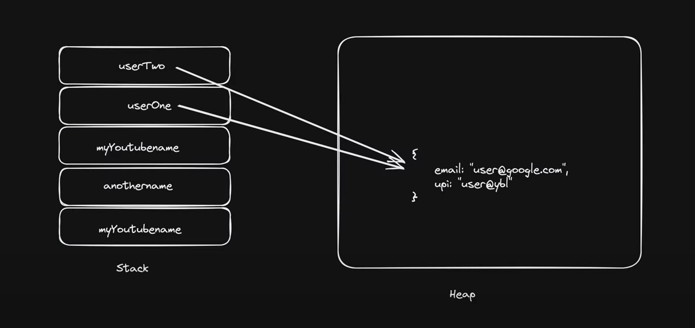
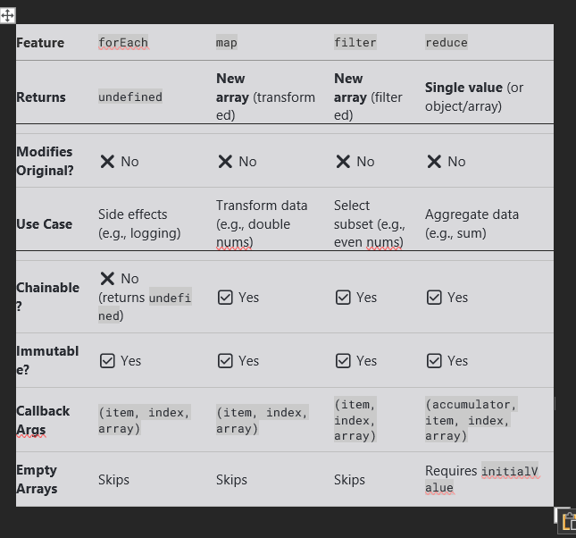
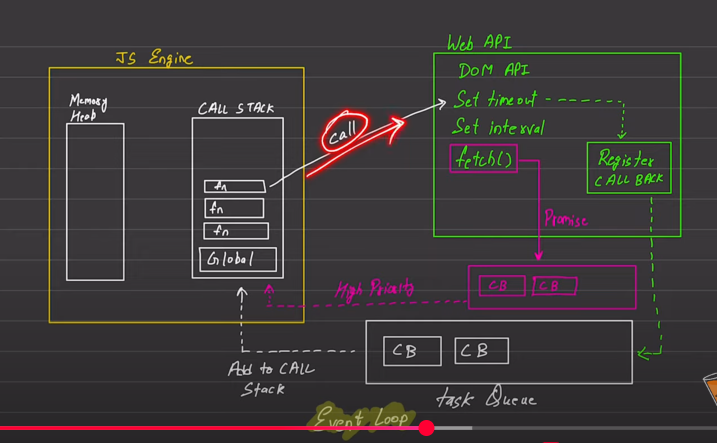
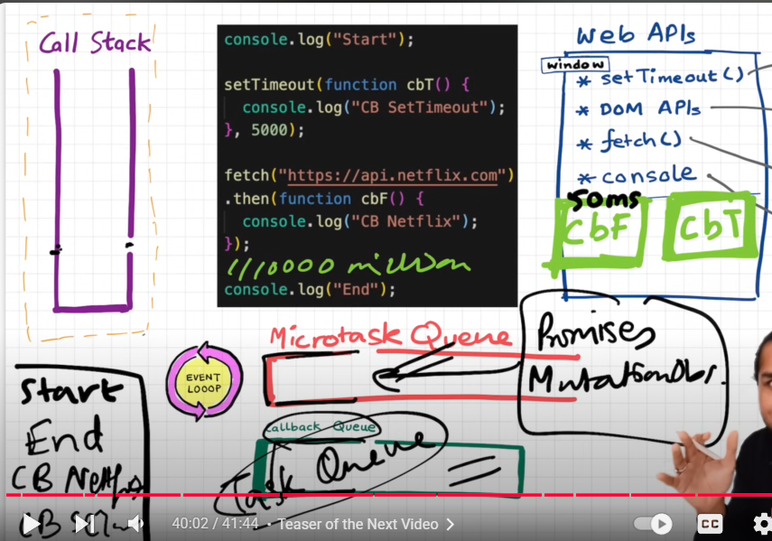
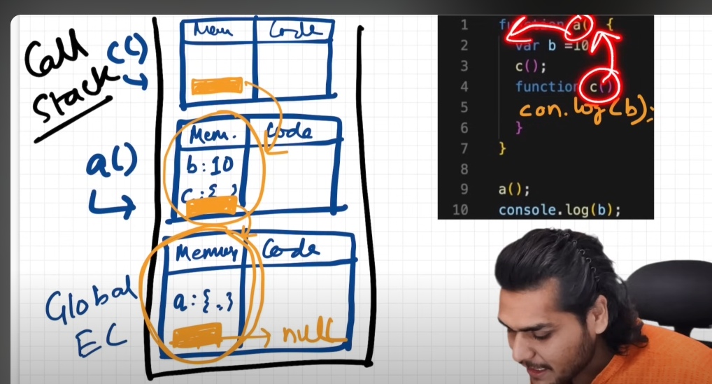

# Learn the most Important Topics using why do we need this ( the problem ) and how does it fix this dont just give def and example 

# Lession 1

-> NodeJS is an environment used to run the JS files ( you can also use Deno )

# Lession 4 ( Variables )

-> Mota Mota try to avoid using var ( scope mein antar ni janta wo so agar block ya functional scope mein same variable galti se change kar diya to har jagah change ho jaega)
-> const ko declare karke initialise karna bhi zaruri hai
-> let ko sirf declare kar sakte ( uski value undefined hogi)
-> Let ko tum ek normal variable maan sakte ho jaise baaki lang mein hota hai

# Lession 5 ( Datatypes )

-> primitive (non referenced -> immutable ) (7 hote hai unke alawa koi bhi aur) non primitive ( reference wale -> mutable)
-> null vs undefined
-> typeof -> data type batata hai us particular varibale ka
-> Interview Question ( typeof null vs undefined )
-> typeof null object return kar deta hai ( jo ki non primitive hai ye kyun???)

    Why typeof null Returns "object" in JavaScript?

    The typeof null returning "object" is a long-standing bug in JavaScript that dates back to the language's early days. It was never fixed because fixing it would break many existing websites that rely on this behavior.

    The Historical Reason
    In the first version of JavaScript (1995), values were stored in 32-bit units:

# The first 3 bits indicated the TYPE TAG

    000 → object

    1 → integer

    010 → double (floating-point)

    100 → string

    110 → boolean

# null was represented as all zeros (00000000...), which matched the object tag (000).

# Thus, typeof null incorrectly returned "object".

    Why Wasn’t It Fixed?
    Backward Compatibility: Many existing websites and scripts relied on this behavior.

    Breaking Changes: Fixing it would cause many programs to fail unexpectedly.

    ECMAScript Spec Acknowledges It:
    The ECMAScript specification explicitly states:

    "The typeof operator returns "object" for null for legacy reasons."

    How to Properly Check for null?
    Since typeof null is misleading, the best way to check for null is:

    const value = null;

    // Correct way:
    console.log(value === null); // true

    // Wrong way (due to the bug):
    console.log(typeof value === "object"); // true (misleading)


# Lession 5 ( Conversion  )

-> NaN is of type Number
-> Boolean mein agar data ya 1 hai to true otherwise false
-> string mein jo doge wo convert ho jaega as it is
-> lekin object ko direct convert karoge to [object Object] aega to use JSON.stringify()

# Lession 5 ( Operations )

-> Math.floor(x/y) or Math.trunc(x/y) for quotient
-> floor gives you the floor as it suggest for neg numbers ( like -3.4) would be -4 but for trunc it will be -3, so use trunc for negatives
-> log("1"+2+3) vs log(1+2+"3")
-> Operator precedance time mile kabhi to padhna

Top 7 Operator Precedence Rules
Precedence	Operator(s)	        Example	            Associativity	Key Behavior
1           () (Grouping)	    (2 + 3) * 4	    →	Highest priority, always first
2	        ** (Exponent)	    2 ** 3 ** 2	    ←	Right-to-left: 2 ** (3 ** 2)
3	        * / %	            3 * 4 / 2 % 3	→	Left-to-right (equal precedence)
4	        + -	                5 + 3 - 1	    →	Left-to-right (equal precedence)
5	        > < >= <=	        5 > 3 === true	→	Comparisons happen before ==
6	        && (Logical AND)	`a && b		c`	→	Higher than ||
7	        = (Assignment)	    a = b = 5	    ←	Right-to-left (chains work)

# Lession 6 ( Comparison )

-> Basic comparison
-> Jab different type ko karo to make sure dono ko same type mein le ao ( like string > int ko ya to int > int karo ya fir str > str karo)
-> null ka comparison zero se

Expression	Result	Why?
null > 0	false	null → 0 (numeric), but 0 > 0 is false.
null == 0	false	null only equals undefined (null == undefined → true) in loosed equality
null >= 0	true	null → 0 (numeric), and 0 >= 0 is true.
null === 0	false	No type coercion; null (object) ≠ 0 (number).

Numeric comparisons (>, <, >=, <=):

null → 0 (null converts to zero ).

Loose equality (==):

null == undefined → true.

null == 0 → false (no numeric coercion here!).

Strict equality (===):

Always checks type + value → null is an object, not a number.


Mere notes

> , < ,>= ,<=  ismein null ko convert karenge in zero then check
== (lose equality) ismein null ko check karte hai undefined se 
=== (strict equality) ismein to type se check hota (object)!=number

Similarly  undefined convert hota hai NaN mein to sabhi conditions false hongi

## lekin undefined==null ( this is true)

-> strict checks


# Lession 7 ( Datatypes Summary)

->  Two Data Type Categories in JavaScript
JavaScript data types are categorized into 2 types based on how they are stored and accessed in memory:

Primitive (Call by Value)

Non-Primitive (Call by Reference)

-> Primitive Data Types (7 Types)
Stored directly in memory (copied when assigned).

Types: Number, String, Boolean, Null, Undefined, Symbol, BigInt.

Example Quirk:

javascript
const id1 = Symbol('123');
const id2 = Symbol('123');
console.log(id1 === id2); // false (unique symbols)
->  Non-Primitive Data Types (Reference Types)
Stored as references (changes affect all copies).

Types: Array, Object, Function, Date, RegExp.

-> JavaScript is Dynamically Typed
Types are checked at runtime (not compile time).

Variables can change types freely:

javascript
let x = 10;      // number  
x = "hello";     // string  
x = true;        // boolean  
-> Static Typing via TypeScript
TypeScript adds static typing (compile-time checks) to JavaScript.

Example:

typescript
let y: number = 10;  
y = "hello"; // Error (TypeScript prevents this).  
Key Takeaway:

Primitive = Copy | Non-Primitive = Reference.

JS flexibility = Dynamic Typing.

TypeScript = Optional Static Typing.

-> Return type of variables in JavaScript

1) Primitive Datatypes
       Number => number
       String  => string
       Boolean  => boolean
       null  => object
       undefined  =>  undefined
       Symbol  =>  symbol
       BigInt  =>  bigint

2) Non-primitive Datatypes
       Arrays  =>  object
       Function  =>  function
       Object  =>  object

# Lession 8 ( Stack and Heap Memory )

-> Stack hold primitive data types 
-> Heap non primitive ( reference copy hota hai ek varibale change karoge to doosra bhi change hoga)

-> Ek note 
    Stack mein wo variable to jaega lets say object wala bas value ki jagah reference ko point karega example ni samjhe to (memory wala dekh lo)

    

# Lession 9 ( Strings )

-> String interpolation allows embedding variables/expressions directly into strings using template literals (enclosed in backticks `).
-> substring cant be used for negative indices use slice instead
-> All methods return a new string (original remains unchanged). ( Immutability )

# Lession 10 ( Nums and Maths )

-> Normal Functions 
-> parseFloat(string)
-> parseInt(string)

# Lession 11 ( Date and Time )

-> Basic date and time functions

# Lession 12 ( Arrays )

-> All built-in array-copy operations (spread syntax, Array.from(), Array.prototype.slice(), and Array.prototype.concat()) create shallow copies. If you instead want a deep copy of an array, you can use JSON.stringify() to convert the array to a JSON string, and then JSON.parse() to convert the string back into a new array that's completely independent from the original array.

-> Shallow means reference same hoga agar ek mein change kiya to doosra bhi change ho jaega
-> Deep copy mein alag alag reference hai to standalone array banega doosra

-> slice vs splice (splice alters the ori array while slice doesn't)

-> shift aur unshift ( naam ke viprit kaam karte (shift removes from beginning,unshift adds))

# Lession 13 ( Arrays 2)

-> Add one array to other
  -> use simple push and then flat(depth) kitne depth tak jana hai see example ( default 1)
  -> use concat ( can only add one array to another )
  -> (Best way) use spread operator 
-> Making array from iterables
  -> use Array.from() ( An iterable (like String, Array, Map, Set )
  -> use Array.of()  ( set of values )
-> if you want to have objects in the array
  -> then either you can get keys Array.from(Object.key(obj))
  -> or you can get values Array.from(Object.values(obj))
  -> one more thing it will place the [key,value] pair as an array in the other array see example
  Array.from(Object.entries(obj))


  # Lession 14 ( Objects 1)

  -> Two ways we can create object ( using constructor ( singleton object would be created) and literal)
  -> can access keys using . or ['key_name']
  -> to use symbol as a key create a symbol using Symbol() and its key would be under [mySymbol] and to access it object_name[mySymbol]

  ->if you want to freeze changes  Object.freeze(JsUser)

  -> If a function is there in any object you can use this keyword to access all the other fields of objects

  # Lession 15 ( Objects 2 )

  -> Merge objects easily using spread operator
  -> U can also use Object.assign wo ni padha maine
  -> Get array of keys using Object.keys(object_name)
  -> get aray of values using Object.values(object_name)
  -> get array of key value pair Object.entries(object_name)

  -> if you want to check if certain property is there in the object or not use object_name.hasOwnProperty('key')

  -> object destructuring {x,y,z,..}=object_name
  where (x,y,z,.. are the properties of object)

  # Lession 16 ( Functions )

  -> functionname is the reference
  -> functionname() is the function call
  -> function hello(x,y)   hello(a,b)  {x,y => parameters and a,b => arguments}
  -> agar parameter main value dal diya hai explicitly to wo le elga jaise hello(name='areeb') agar ni paas karte kuch to areeb le lega
  -> function ke andar function return bhi kar sakte ho
  -> use ... ( rest operator ) when not sure about the number of parameters
  # Lession 17 ( Scopes )

  Feature
              var	            let	             const
Scope	        Function	      Block	           Block
Hoisting	    Yes (undefined)	Yes (TDZ)	       Yes (TDZ)
Reassignment	✅ Yes	        ✅ Yes	          ❌ No
Redeclaration	✅ Yes	        ❌ No	          ❌ No
Use Case	    Legacy code	    Mutable variables	Constants

-> Ek important note var function scoped hai iska agar wo kisi function ke andar hai tab to bahar access ni hoga lekin agar kisi aur cheez ke andar jaise loops , {} tab accessible hoga

-> Basic functional scopes 
-> Hoisting intro ( Can access functions before initialization but not variable)

var is Function-Scoped (not Block-Scoped)

Variables declared with var are only scoped to functions, not to blocks ({}, if, for, while, etc.).

If var is inside a function, it cannot be accessed outside.

If var is inside a block (but not a function), it can be accessed outside.

Examples:

✅ Case 1: var Inside a Function (Not Accessible Outside)
javascript
function test() {
    var x = 10; // Function-scoped
    console.log(x); // 10 (works inside)
}
test();
console.log(x); // ReferenceError: x is not defined (cannot access outside)
✔️ Correct: var is trapped inside the function.

❌ Case 2: var Inside a Block (Accessible Outside)
javascript
if (true) {
    var y = 20; // Not block-scoped (leaks outside)
    console.log(y); // 20 (works inside)
}
console.log(y); // 20 (still accessible outside!)
⚠️ Problem: var ignores block scope ({}, if, for, etc.) and leaks outside.

❌ Case 3: var in a Loop (Leaks Outside)
javascript
for (var i = 0; i < 3; i++) {
    console.log(i); // 0, 1, 2
}
console.log(i); // 3 (still accessible outside the loop!)
⚠️ Problem: i leaks outside the loop (unlike let/const).

Block Scope (let, const)
Variables declared with let/const are block-scoped.

They are only accessible inside the block ({}) where they are declared.

They do NOT leak outside blocks (if, for, while).


Simple sa ye yaad rakho 

-> let and const are block scoped ({}) iske andar hi accessible hai
-> var is function scoped ( agar sirf function mein hoga to not accessible ousidee) otherwise sabmein hoga

# Lession 18 ( Arrow and This )

-> Browser mein log(this)  will return window Object which is the Global Object ( which acts as a container for all the variable declared globally )
-> in node environment {} 
-> this points to the current context ( obect mein this.key access kar sakte ho lekin this.var_name in function undefined degaa )
-> Why do we use this in normal functions and not in arrow function? ( dekha tha maine to function mein bahut kuch a rha tha , arrow mein ni aya sirf {} aya ( wo is liye kyun uska immediate parents scope was global scope ( node mein tha isliye {} aya browser mein hota to window ata)))

Simple answer hai normal mein they have their own binding is liye usmein ata hai wo sab data, lekin arrow func mein khud ki koi binding ni hoti hai isliye wo this keyword immediate parent ke scope ko refer karta hai ....

Learn more

The this keyword behaves differently in normal functions compared to arrow functions. Normal functions have their own this binding, which is determined by how the function is called (e.g., as a method, via new, call, apply, or bind).
 This allows the this value to be dynamically set based on the context of the call.

In contrast, arrow functions do not have their own this binding.
 Instead, they inherit the this value from the enclosing (lexical) scope where they are defined.
 This means that this inside an arrow function refers to the this value of the nearest non-arrow parent function or the global object if no such parent exists.

 # Lession 19 ( IIFE )

->In JavaScript, when you declare variables or functions without any protection, they automatically become part of the global scope (usually the window object in browsers). This leads to global namespace pollution, which can cause:
->Naming Collisions – If two scripts use the same variable name, they overwrite each other.
->Memory Leaks – Unused variables stay in memory because they’re globally accessible.
->Unpredictable Bugs – Other scripts can accidentally modify your variables.

How IIFE Solves This?
-> An IIFE creates a private scope where variables are confined inside the function and disappear after execution.

// standard IIFE
(function () {
  // statements…
})();

// arrow function variant
(() => {
  // statements…
})();

// async IIFE
(async () => {
  // statements…
})();

-> Named IIFE ( functional one) and Normal IIFE arrow function
-> We can use multiple iife just remember to add semi colon ( that can be anywhere before the start of the other function) 
-> In our code example I have taken one after the other ( lekin man lo doosra wala hazaar line ke baad hota lekin agar kahin bhi ; a jega to cancel ho jaega wo lekin hn dhyan rakhna ki semicolon turant laga do call hone ke just baad ()(); )


# Lession 20 ( Execution Context and Call Stack)

## Everything in JS happens inside an execution context

## JavaScript is synchronous single threaded language

->An Execution Context is the environment where JavaScript code runs, consisting of:

Variable Environment (hoisting, scope).

Scope Chain (access to outer variables).

this Binding (context-dependent).

It is created in two phases (Memory Allocation → Execution) and managed via the Call Stack.

-> For In depth look at the code


# Lession 21 ( Control Flow )

-> If you dont add break it will execute all the staments below it till it finds next break it can even execute default

-> So, inside a switch statement, once a case statement matches the given variable, all following statements will be executed ignoring the criteria until a break statement or closing curly bracket is encountered

-> default can be placed anywhere

-> Truthy values and Falsy Values

-> Learn falsy values 

false, 0 ,-0,BigInt 0n,"",null,undefined,NaN

-> Nullish Coalescing Operator (??)

-> // || drops falsy value ( Ex - cnst val = 0 || 2 -> val takes 2)


# Lession 22 ( Loops )

-> for, while and do while ( runs atleast once before checking the conditions)

-> for objects we can use for in and for maps use for of ( for of mein o ata hai yaad rakho no for objects )

for	        for (let i = 0; i < 5; i++)	  Fixed iterations (arrays, strings)
while	      while (condition)	            Looping until a condition is false
do...while	do { ... } while (condition)	Executes at least once before checking condition
for...in	  for (let key in object)	      Enumerating object properties (not recommended for arrays)
for...of	  for (let value of iterable)	  Iterating over iterables (arrays, strings, maps, sets, etc.) ( not in objects )
forEach()	  array.forEach((item) => {})	  Iterating over arrays (does not work on objects)


-> forEach Loop

-> they want a callback function (it doesn't have a name)
-> doesn't return anything
-> you can create a function outside and give it to it ( but use reference only dont add () after it in loop) arr.forEach(handleFunc) ( see example if not clear)

-> forEach has got multiple parameters some of them are
-> we have forEach((val,index,ori_array)) // names might change but the position of these params remains the same

# Lession 23 ( filter map reduce )

-> forEach doesn't return any value ( neither by its function nor will return explicitly )



-> filter , map , reduce in detail

# Lession 24 ( DOM )

-> DOM ( or Dcoument Object Model) represents the structure of the HTML/XML document as a tree of objects, allowing JavaScript to dynamically manipulate content, structure, and styles.

-> Tree-like structure where each HTML element is a node.

JavaScript can interact with the DOM to:

Change content (innerHTML, textContent).

Modify styles (style, classList).

Add/remove elements (appendChild, remove).

Handle events (click, keypress).

jaise ki one.html mein we have html as parent node
                     window

                     document

                      html
                head            body
attribute    <- meta   title    div -> attribute(classname etc)
                   text      p      div
                            text    text


2. DOM Node Types
Node Type	Example	Description
Element	<div>, <p>	HTML tags.
Text	"Hello World" (inside <p>)	Text content.
Attribute	class="header"	Attributes of elements.
Document	document	Root node.
Comment	<!-- comment -->	HTML comments.


3. HTML Collection , Object Collection array ni hai lekin array jaise hai

-> setAttribute hamesha override karega

-> HTMLCollection and NodeList

-> HTMLCollection mein forEach bhi ni hai to convert to array Array.from(source) and then use , ismein bhi map ni hai

-> NodeList mein we dont have map but we have forEach


two.html()

-> parent and child relation ( also sibling ones)

-> Important childNodes thing

three.html()

-> createTextNode('Text')


four.html()

for text remeber use dom.createTextNode(text) ( dont use innerHTML,textContent and all)


-> how to edit? ( use replaceWith)
-> also u can hardocre using outerHTML

for delete

select the tag to be deleted

tag.remove()


# Lession 25 ( Events )

Events are actions or occurrences that happen in the browser that JavaScript can respond to. They're a fundamental part of interactive web applications, allowing your code to react to user actions, browser activities, and other triggers.

Common Types of Events
Mouse Events
click - When an element is clicked

dblclick - Double click

mouseenter - Mouse pointer enters an element

mouseleave - Mouse pointer leaves an element

mousemove - Mouse moves over an element

mousedown - Mouse button is pressed down

mouseup - Mouse button is released

Keyboard Events
keydown - A key is pressed down

keyup - A key is released

keypress - A key is pressed (deprecated)

Form Events
submit - When a form is submitted

change - When an input element's value changes

focus - When an element gets focus

blur - When an element loses focus

input - When an input element's value changes (fires immediately)

Window/Document Events
load - When the page has finished loading

DOMContentLoaded - When the DOM is fully loaded (no need to wait for stylesheets, images)

resize - When the browser window is resized

scroll - When the user scrolls

Event Handling Methods
1. HTML Attribute
html
<button onclick="alert('Clicked!')">Click me</button>
2. DOM Property
javascript
const btn = document.querySelector('button');
btn.onclick = function() {
  alert('Clicked!');
};
3. addEventListener() (Recommended)
javascript
const btn = document.querySelector('button');
btn.addEventListener('click', function() {
  alert('Clicked!');
});
Event Object
When an event occurs, the browser creates an event object containing information about the event, which is passed to the event handler:

javascript
element.addEventListener('click', function(event) {
  console.log(event.type); // "click"
  console.log(event.target); // The element that was clicked
});


-> why no second approach

a) Only one handler allowed in onclick while multiple handlers you can write those will execute at the same time

// Using onclick (BAD)
button.onclick = function() { console.log('First'); };
button.onclick = function() { console.log('Second'); }; // Overwrites the first!

// Using addEventListener (GOOD)
button.addEventListener('click', () => console.log('First'));
button.addEventListener('click', () => console.log('Second')); // Both run!


b) No control over Event Phase( Bubbling or capturing phase)
c) Sometimes event object is not passed to the handler function unless explicitly given

document.querySelector('.classname').addEventListener('event',function(){},false) // this last false is default so whether u write it or not not no effect

-> false is for bubbling phase ( child-to-parent) ( bubble analogy)
-> true is for capturing phase ( par-to-chil)

-> function ka agar naam ni hai to that function ko remove ni kar paoge
-> Hamesha dhyan dena ki sirf reference likho, () add na karna end mein warna turant invoke ho jaega or undefined store ho jaega event listerner mein

1. Event Basics (type, timestamp, preventDefault())
type (String)
Returns the name of the event (e.g., "click", "keydown").

javascript
button.addEventListener("click", (e) => {
  console.log(e.type); // "click"
});
timestamp (Number)
Returns the time (in milliseconds) when the event occurred (relative to page load).

javascript
document.addEventListener("mousemove", (e) => {
  console.log(e.timeStamp); // e.g., 1234.56
});
preventDefault() (Method)
Stops the default browser behavior (e.g., preventing a form submission or link navigation).

javascript
link.addEventListener("click", (e) => {
  e.preventDefault(); // Stops the link from navigating
});
2. Event Target Properties (target, toElement, srcElement)
target (Element)
The element that triggered the event (deepest in the DOM).

javascript
document.addEventListener("click", (e) => {
  console.log(e.target); // <button>Click</button>
});
currentTarget (Element)
The element the listener is attached to (useful in event delegation).

javascript
parent.addEventListener("click", (e) => {
  console.log(e.currentTarget); // Always <div id="parent">
});
toElement & srcElement (Legacy)
Deprecated versions of target (used in old IE).

Modern code should use target instead.

3. Mouse/Touch Position Properties
clientX, clientY (Number)
Coordinates relative to the viewport (window).

javascript
document.addEventListener("mousemove", (e) => {
  console.log(`X: ${e.clientX}, Y: ${e.clientY}`);
});
screenX, screenY (Number)
Coordinates relative to the entire screen (includes scroll and OS toolbars).

javascript
document.addEventListener("click", (e) => {
  console.log(`Screen X: ${e.screenX}, Screen Y: ${e.screenY}`);
});
pageX, pageY (Number)
Coordinates relative to the full page (accounts for scrolling).

javascript
document.addEventListener("click", (e) => {
  console.log(`Page X: ${e.pageX}, Page Y: ${e.pageY}`);
});
offsetX, offsetY (Number)
Coordinates relative to the target element's border.

javascript
button.addEventListener("click", (e) => {
  console.log(`Inside button: X=${e.offsetX}, Y=${e.offsetY}`);
});
4. Keyboard/Modifier Key Properties
altKey, ctrlKey, shiftKey, metaKey (Boolean)
Returns true if the key was pressed during the event.

javascript
document.addEventListener("keydown", (e) => {
  if (e.ctrlKey && e.key === "s") {
    e.preventDefault(); // Block Ctrl+S save
  }
});
keyCode (Deprecated)
Legacy property for keyboard key codes (avoid; use key or code instead).

javascript
document.addEventListener("keydown", (e) => {
  console.log(e.key); // "Enter", "a", "ArrowUp" (modern)
  console.log(e.code); // "KeyA", "Space" (physical key position)
});
Modern Replacements:
Legacy	Modern Equivalent
e.keyCode	e.key or e.code
e.which	e.key
5. Practical Example
javascript
document.addEventListener("click", (e) => {
  console.log("Event type:", e.type);
  console.log("Target element:", e.target);
  console.log("Mouse position (viewport):", e.clientX, e.clientY);
  
  if (e.ctrlKey) {
    console.log("Ctrl was held during click!");
  }
});

-> EVENTS PROPAGATION ( Please look into the code v.v.v.imp)

Main ek table bana raha hun thik ki kab kaunsa true hai 
            1  2  3  4  5  6 7  8
Child       T  T  T  T  F  F F  F
parent      T  T  F  F  T  T F  F
grandparent T  F  T  F  T  F T  F

1 -> g p c
2 -> p c g
3 -> g c p
4 -> c p g
5 -> g p c
6 -> p c g
7 -> g c p
8 -> c p g


### ALGO

### pehle upar se neeche aega check karta hua ki kis kis mein T hai agar tru hai to wo event chal jaega agar ni hai to phase 1 mein kuch ni hoga

### -> phase 2 mein neeche se upar jaega ye check karta hu ki false kitne mien hai


->


Event Propagation in JavaScript: A Deep Dive
Event propagation describes how events travel through the DOM tree. Understanding it is crucial for proper event handling. There are three phases in event propagation:

1. The Three Phases of Event Propagation
(1) Capturing Phase (Top-Down)
Event travels from the window down to the target element.

Rarely used, but useful for intercepting events early.

To listen in this phase, set capture: true in addEventListener.

(2) Target Phase
Event reaches the actual target element that triggered it.

(3) Bubbling Phase (Bottom-Up)
Event bubbles back up from the target to the window.

Default behavior for most event listeners.

html
<div id="grandparent">
  <div id="parent">
    <button id="child">Click Me</button>
  </div>
</div>
javascript
const elements = ["grandparent", "parent", "child"];

elements.forEach(id => {
  document.getElementById(id).addEventListener("click", () => {
    console.log(`Capturing: ${id}`);
  }, true); // Capturing phase

  document.getElementById(id).addEventListener("click", () => {
    console.log(`Bubbling: ${id}`);
  }, false); // Bubbling phase (default)
});
Output when clicking the button:

text
Capturing: grandparent  
Capturing: parent  
Capturing: child  
Bubbling: child  
Bubbling: parent  
Bubbling: grandparent  
2. Controlling Propagation
event.stopPropagation()
Stops the event from moving further in both capturing and bubbling phases.

Example: Prevent parent elements from receiving the event.

javascript
child.addEventListener("click", (e) => {
  e.stopPropagation(); // Stops at target phase
  console.log("Child clicked (propagation stopped)");
});
event.stopImmediatePropagation()
Stops all remaining listeners (even on the same element).

javascript
child.addEventListener("click", (e) => {
  e.stopImmediatePropagation(); // Blocks other listeners
  console.log("First listener (blocks others)");
});

child.addEventListener("click", () => {
  console.log("This won't run!");
});
event.preventDefault() vs stopPropagation()
Method	Purpose
preventDefault()	Stops default browser behavior (e.g., form submission).
stopPropagation()	Stops event bubbling/capturing (but default action still happens).
3. Event Delegation (Bubbling in Practice)
Instead of attaching listeners to every child, use bubbling to listen on a parent:

html
<ul id="list">
  <li>Item 1</li>
  <li>Item 2</li>
  <li>Item 3</li>
</ul>
javascript
document.getElementById("list").addEventListener("click", (e) => {
  if (e.target.tagName === "LI") {
    console.log(`Clicked: ${e.target.textContent}`);
  }
});
✅ Benefits:
✔ Works for dynamically added elements.
✔ Uses less memory (single listener instead of many).

4. When to Use Capturing vs Bubbling
Phase	Use Case
Capturing (true)	Intercept events before they reach the target (e.g., analytics tracking).
Bubbling (false)	Default for most cases (e.g., handling button clicks).
5. Summary Table
Concept	Description
Capturing Phase	window → Target (use capture: true).
Target Phase	Event reaches the target element.
Bubbling Phase	Target → window (default).
stopPropagation()	Stops further event travel.
stopImmediatePropagation()	Stops all remaining listeners.
Event Delegation	Listen on parent, check e.target.
Best Practices
Prefer bubbling unless you need early interception.

Use event delegation for dynamic elements.

Avoid excessive stopPropagation() (can break expected behavior).

Clean up listeners with removeEventListener.

Understanding propagation helps you control event flow and write efficient, scalable event handlers. 🚀

## jis jis pe event laga hoga wo execute hota jaega in any phase ( bubbing or capturing )

# Lession 26 ( Events continues ( event delegation))

-> Event delegation is a powerful pattern in JavaScript where instead of attaching event listeners to individual child elements, you attach a single listener to a parent element and let events "bubble up" from the children. This leverages event propagation (bubbling) to handle events efficiently.

-> Hamare example mein li mein to event laga ni hai , to kya hua bubble to karega na parent pe ( to parent wala run ho jaega)

-> we also studied how to remove a child in this case

# Lession 27 ( Asynchronous Programming - Event Loop)

-> By default JS is synchronous(executes line by line) and single threaded application
-> Each op waits for the last one to complete before executing ( since thread is one hence thisss)

Blocking vs Non Blocking Code

-> Blocking - Block the flow of the program ( API req ( fetch() without callbacks or promises ), file reading)
-> Non Blocking - Doesn't blobk execution

Blocking: "Make this request and wait here until you get a response"

Non-blocking: "Make this request and let me know when you have the response"

SO make everything blocking then?

-> NOOO, take an example that you want to register a user , so u input detail , store it in a db and inform user with a success message

-> But here if you say lets inform user just like that even before the db is updated ( ho sakta hai db mein problem a jae lekin tum to success message bhej chucke ho )

-> Isliye it depends on the use case

## Web APIs

-> So we have got a single call stack in ***JS engine***
-> it will execute everything line by line
-> but what if we want to stop execution for sometime or their is a task which takes some time
-> so we then use Web APIs, some of them are

a) setTimeOut()
b) DOM API
c) fetch()
d) localstorage
e) console

***they are not the part of js but the environment in which JS runs  the above ones are for browser , similary some changes in node etc***

Example

``` javascript
console.log("First")
setTimeout(function cb1(){
      console.log("Second")
},2000)
setTimeout(function cb2(){
      console.log("Third")
},1000)
console.log("Fourth")
```

pehle gec stack mein jaega fir
console.log("First") execute hoga (sync code). Phir dono setTimeout register honge:

cb1 (2000ms ka)

cb2 (1000ms ka)

Phir console.log("Fourth") chalega (kyuki setTimeout non-blocking hai).

aur gec ab stack se hat jaega

Ab Web API mein:

cb2 (1000ms wala) pehle complete hoga aur ***callback queue or task queue*** mein jayega.

cb1 (2000ms wala) baad mein complete hoke queue mein jayega.

***Event loop check karega ki call stack khali hai***, phir queue se FIFO order mein callbacks execute honge:

cb2 → "Third" print hoga

cb1 → "Second" print hoga

Final Output:

First  
Fourth  
Third  
Second  


So , I think sare questions answer ho gae honge Ni hote hai to again watch the lecture also

TO visualize go here (http://latentflip.com/loupe)


##### So QnA jo mujhe ae dimag mein

-> Kya event loop call stack khali hone ke baad add karega ? Haan
-> what if code poora execute ni ho paya aur queue mein banda a agay ( lets setTimout 2 s ka tha aur code exe 10s ) to ab kya? kuch ni same cheez wo tab tk queue se bahar ni aega jab tk code poora execute ni ho jata

##### Example for event listener

-> usmein bhi same wo register hoke rakha rahega jab click hoga to queue mein a jega  ( 10 baar click kara to?? 10 baar aega)
-> lekin ismein jo event ka callback hai web api environment mein pada rah jaega hamesha ke liye isliye we tend to remove event listeners

##### One example for fetch

console.log('first')

setTimeout(function cbT(){
  console.log('CB setTimeOut')
},5000);

fetch(url)
.then(function cbF(){
  console.log("CB Netflix")
})
// millions line of code
console.log("End")


-> to ismein promises aur MutationObserver karke kuch hota hai inke liye ***microtask queue*** banti hai
-> Event loop pehel ismein check karta hai ki koi task to ni aya agar hota hai to pehle ye execute hoga 
-> Fir call back wali

-> flow Event loops exectues all the task in microtask queue and then check for call back queue

Example mein  ( man lo url se respone bahut hi kam second mein a agya micro mein to kya wo execute ho jaega ya fir millions of line execute hone ka wait karega ?? wait karega )

first
End
CB Netfl 
CB setT


One Problem

-> agar microtask ko doosre microtask ko call kare aur karta hi jae tab?? bechare call back ka to number hi ni aega ?? ***Sahi BAAT***

-> This is what we call as **Starvation** of a task in Callback queue




# Lession 28 ( Async Programming - async functions)

-> setTimeout() for once , setInterval for repeating
-> clearTimeout(reference of a setTime) for removing it ( But haan uske time limit expire h jaega tb koi faayda ni hai remove karne ka)

```javascript
// delay by default is 0 for setTimeout
setTimeout(callback, delayInMs,params1,params2,....); // these params are call back functions paramas

// Output (after 2 sec): "Hello, Rahul! You are 25 years old."
setTimeout(
  (name, age) => console.log(`Hello, ${name}! You are ${age} years old.`), 
  2000, 
  "Rahul", 
  25
);


setInterval(callback, interval,params1,params2,....); // these params are call back functions paramas
let count = 0;
setInterval(
  (msg, num) => console.log(`${msg} ${num}`), 
  1000, 
  "Count:", 
  ++count
);
// Output (every 1 sec): "Count: 1", "Count: 2", ...

```

->*Remember to clear setInterval everytime ur work is done*


# Lession 29 ( APIs and V8 Engine)

-> We used to have XMLHttpRequest


# Lession 30 ( Promises )

```javascript

Promises in JavaScript - Detailed Explanation
A Promise in JavaScript represents the eventual completion (or failure) of an asynchronous operation and its resulting value. It is a way to handle async operations more elegantly than callbacks.

1. Promise States
A Promise can be in one of these states:

Pending – Initial state (neither fulfilled nor rejected).

Fulfilled – Operation completed successfully (.then() runs).

Rejected – Operation failed (.catch() runs).

text
Pending → Fulfilled (Resolved)  
Pending → Rejected (Error)
2. Creating a Promise
Syntax
javascript
const myPromise = new Promise((resolve, reject) => {
  // Async operation (e.g., API call, setTimeout)
  if (success) {
    resolve("Success Data"); // Promise fulfilled
  } else {
    reject("Error Message"); // Promise rejected
  }
});
Example (Simulating API Call)
javascript
const fetchData = new Promise((resolve, reject) => {
  setTimeout(() => {
    const success = true; // Simulate success/failure
    if (success) {
      resolve({ id: 1, name: "John Doe" }); // Success
    } else {
      reject("Failed to fetch data!"); // Error
    }
  }, 2000);
});
3. Consuming Promises (.then(), .catch(), .finally())
.then() – Success Handler
javascript
fetchData
  .then((data) => {
    console.log("Data received:", data);
  });
.catch() – Error Handler
javascript
fetchData
  .then((data) => console.log(data))
  .catch((error) => console.error("Error:", error));
.finally() – Runs Always
javascript
fetchData
  .then(data => console.log(data))
  .catch(err => console.error(err))
  .finally(() => console.log("Request completed!"));
4. Chaining Promises
Promises can be chained to avoid "callback hell":

javascript
fetchData
  .then((user) => {
    console.log("User:", user);
    return fetchUserPosts(user.id); // Return another Promise
  })
  .then((posts) => {
    console.log("Posts:", posts);
  })
  .catch((err) => {
    console.error("Error in chain:", err);
  });
5. Promise Static Methods
Promise.resolve()
Creates an already resolved Promise:

javascript
Promise.resolve("Hello").then((val) => console.log(val)); // "Hello"
Promise.reject()
Creates an already rejected Promise:

javascript
Promise.reject("Error!").catch((err) => console.log(err)); // "Error!"
Promise.all()
Waits for all Promises to resolve (or any to reject):

javascript
const p1 = Promise.resolve("Task 1");
const p2 = new Promise((resolve) => setTimeout(resolve, 1000, "Task 2"));

Promise.all([p1, p2])
  .then((results) => console.log(results)) // ["Task 1", "Task 2"]
  .catch((err) => console.error(err));
Promise.race()
Returns the first settled Promise (resolved/rejected):

javascript
const p1 = new Promise((resolve) => setTimeout(resolve, 500, "Fast"));
const p2 = new Promise((resolve) => setTimeout(resolve, 1000, "Slow"));

Promise.race([p1, p2])
  .then((result) => console.log(result)); // "Fast" (wins the race)
Promise.allSettled()
Waits for all Promises to settle (success/failure):

javascript
Promise.allSettled([p1, p2])
  .then((results) => console.log(results));
// Output:
// [
//   { status: "fulfilled", value: "Task 1" },
//   { status: "rejected", reason: "Error!" }
// ]
6. Async/Await (Syntactic Sugar for Promises)
async Functions
Always return a Promise.

Use await to pause execution until Promise settles.

Example
javascript
async function fetchUser() {
  try {
    const user = await fetchData; // Waits for fetchData to resolve
    console.log("User:", user);
  } catch (err) {
    console.error("Error:", err);
  } finally {
    console.log("Done!");
  }
}

fetchUser();
7. Common Promise Mistakes
Forgetting .catch() → Unhandled rejections crash apps.

Not returning in .then() → Breaks chaining.

Mixing callbacks & Promises → Leads to messy code.

8. Real-World Use Cases
API Requests (fetch, Axios)

File Reading (fs.readFile in Node.js)

Timers (setTimeout wrapped in Promises)

Database Queries (Mongoose, Sequelize)

Summary
Concept	Usage
new Promise()	Creates a Promise
.then()	Handles success
.catch()	Handles errors
.finally()	Runs always
Promise.all()	Waits for all Promises
Promise.race()	First settled Promise wins
async/await	Cleaner Promise handling
Promises make async code manageable and avoid callback hell! 🔥🚀


```

#### Some interesting codes

```javascript

new Promise(function (resolve,reject){
    setTimeout(()=>{
        console.log('Async task 2 is complete');
        resolve()
    },10)
}).then(function(){
    console.log('Promise 2 consumed');
})
    

async function getDetails(){
    try {
        const response= await fetch('https://jsonplaceholder.typicode.com/users')
        const data=await response.json()
        
        console.log(data);
        console.log('----------------------')
    } catch (error) {
        console.log(error);
    }

}

getDetails()


// For the above code only


// Pehle wala promise pehle output hoga obvisouly because of event loop concept
// lekin usko agar 2-3 sec kar do ho sakta hai ki pehle api wala output ho jae

// .then wale sabhi function microtask queue mein jaenge , ye jo setTimeout wala hai wo callback queue mein hi jaega aur jab wo run hoga tb .then wala jo promise hai 'Promise 2 consumed' ye run hoga microtask queue se  


// lekin agar tum is tareeqe se samjho ki wo promise ke andar kar diya hai to ( promis1 promis2 ho gaya jo pehle ho jaega wo pehle run hoga ) -> is analogy se yaad kar sakte ho but its not correct , correct upar wala hai

```

#### ek aur cheez chahe status code koi bhi ae wo jata resolve mein hi hai

```javascript
// fetch rejects only on network failures ( browser request hi na kar paya hai) or cors error, not HTTP errors (400/500).

// 2. Kab Reject Hota Hai?
// Only for Network Errors:

// Internet offline

// Invalid URL (CORS issue)

Success (200-299):

javascript
fetch(url) // 200 OK
  .then(response => {
    console.log(response.ok); // true
    console.log(response.status); // 200
  });


❌ Error (400/500):

javascript
fetch(invalidUrl) // 404 Not Found
  .then(response => {
    console.log(response.ok); // false (but still resolved!)
    console.log(response.status); // 404
  })
  .catch(error => {
    // Ye CHALEGA HI NAHI (unless network failure)
  });

4. Key Points
fetch rejects only on network failures, not HTTP errors (400/500).

Manual check karna zaroori hai:

response.ok (true for 200-299)

response.status (actual status code)

axios different hai: Ye automatically reject karta hai 400/500 pe.


```

# Lession 31 ( OOPS )

### Does JS have classes? 

Yes, JS has classes (introduced in ES6, 2015), but they are **syntactic sugar** over JavaScript’s **prototype-based inheritance**.

Basically JS is prototype-based language , but to make it easier for the developers coming from the different types of OOPs languages this was introduced

### What is OOPs then?

*OOP (Object-Oriented Programming) is a programming paradigm that organizes software design around objects rather than functions and logic.*

### What are objects?

Objects are the fundamental building blocks of JavaScript. They are unordered collections of key-value pairs (properties) where:

***Keys are strings (or Symbols)***

Values can be any data type (primitives, functions, other objects)


### What are constructor functions?

```javascript

Constructor functions are special functions used to create and initialize objects. They serve as blueprints for creating multiple objects of the same type.

1. Basic Constructor Function

Syntax

function Person(name, age) {
  this.name = name;  // 'this' refers to the new object
  this.age = age;
  this.greet = function() {
    console.log(`Hello, I'm ${this.name}`);
  };
}

// Creating an instance
const john = new Person("John", 30);
john.greet(); // "Hello, I'm John"

Key Points
✔ Must be called with new (otherwise, this points to the global object)
✔ Convention: Constructor names start with a capital letter (Person, Car, etc.)
✔ Inside the constructor, this refers to the newly created object
```

###  What Happens When new is Used?


A new empty object {} is created

The constructor's this is set to this new object

The constructor function executes (adding properties to this)

The new object is returned automatically (unless the constructor returns a different object)


Use ***instanceof*** to check if an object was created from a constructor


-> Agar classes aur object na bhi ho fir bhi sirf objects ( sare pillars of OOPs follow karta hai )


# Lession 32 ( Prototypes)

-> JS is prototype-based language 


# Lession 33 ( Call , bind and apply )

-> Yeh teeno (call, bind, aur apply) functions ke context (this value) ko control karne ka kaam karte hain.
-> Agar tum this ki value change karna chahte ho, toh in teeno methods ka use hota hai.

-> Why Call? ( See the code america inr wala example )
-> Call vs Bind Vs Apply

🔥 Summary Table: call vs apply vs bind
Method	Execution	Arguments Format	Returns
call	Turant	(this, arg1, arg2)	Function result
apply	Turant	(this, [arg1, arg2])	Function result
bind	Baad Mein	(this, arg1, arg2)	New Function

-> bind aram se baad mein jab bhi use karne ka man ho tb karo


# Lession 34 ( Objects Advanced -> Interview Question Can you change the value of Math.PI if yes how? if not why? )


## a) Jab bji kisi property ko tum set (obj_name.prop=val) ya get (obj_name.prop ) to sabse pehle wo dekhti hai ki getters and setters to ni hai

## b) agar hai to wahan se set aur get karti hai 


```javascript
Object.getOwnPropertyDescriptor() - Ek Property Ki Jaankari
Kaam: Object ki ek specific property ke baare mein complete details deta hai.

Example:
javascript
const user = {
  name: "Rahul",
  age: 30
};

// Sirf 'name' property ka descriptor
const nameDescriptor = Object.getOwnPropertyDescriptor(user, 'name');
console.log(nameDescriptor);
/* Output:
{
  value: "Rahul",
  writable: true,
  enumerable: true,
  configurable: true
}
*/
Key Points:
✔ Ek baar mein sirf ek property check kar sakte hain
✔ Property exist nahi karti toh undefined return karta hai

2. Object.getOwnPropertyDescriptors() - Saari Properties Ki Jaankari
Kaam: Object ki sabhi own properties ke descriptors ek saath deta hai.

Example:
javascript
const user = {
  name: "Rahul",
  age: 30
};

// Poora object ke sab descriptors
const allDescriptors = Object.getOwnPropertyDescriptors(user);
console.log(allDescriptors);
/* Output:
{
  name: {
    value: "Rahul",
    writable: true,
    enumerable: true,
    configurable: true
  },
  age: {
    value: 30,
    writable: true,
    enumerable: true,
    configurable: true
  }
}
*/
```

**See Examples in Script**

***Last ki kuch lines zarurr padhna***


# Lession 35 ( Getters and Setters )

**Why this create and issue ( stack overflow )** 

```javascript

class User{
    constructor(email,password){
        this.email=email
        this.password=password
    }
    get email(){
        return this.email
    }
    set email(val){
        this.email=val
    }
}

const userOne=new User('test@google.com',"123")
console.log(userOne.email);


// but this create an issue

step by step explanation

a) Jab bji kisi property ko tum set (obj_name.prop=val) ya get (obj_name.prop ) to sabse pehle wo dekhti hai ki getters and setters to ni hai

b) agar hai to wahan se set aur get karti hai 

c) Okk so, with this knowledge tum ismein dekho

d) When you do new User("test@google.com", "123"):
    1. Constructor runs this.email = email
    2. JavaScript sees this as a property assignment, so it:
    3. Checks if there's a set email() defined
    4. Finds your setter and calls it with the value

e) Inside your setter:

    1.You wrote this.email = val
    2. This is another property assignment
    3.So JavaScript again checks for set email()
    4. Calls the setter again... and again... ∞

Similary this is for setter as well

```

**FIX**

```javascript

class User{
    constructor(email,password){
        this._email=email
        this._password=password
    }
    get email(){
        return this._email
    }
    set email(val){
        this._email=val
    }
}

const userOne=new User('test@google.com',"123")
console.log(userOne.email);

// Dekh bhai step by step

What Happens in Constructor:

1. Creates new object {}

2. Runs constructor with provided values:
   a. this._email = 'test@google.com' → Direct assignment to _email doesn't call setter
   b. yahan pe bhi js dekhe ga ki _email naam se setter hai to paega ki ni hai so wont call the fuction
   b. this._password = "123" → Direct assignment to _password doesn't call getter
   c. yahan pe bhi js dekhe ga ki _email naam se getter hai to paega ki ni hai so wont call the fuction

3. Ab jab tum set karoge manlo (obj.email='hello')
    a. JS dekhega ki koi setter hai email naam se
    b. Haan hai to kya karo _email mein "hello" dal do
    c. similarly for get

Key note:

// Ismein loop mein fase hi ni

```

*ES2022 wala bhi dekh lena*

Benefits Over Old Pattern:
Old Way (_email)	ES2022 Way (#email)
Convention-based privacy	Real privacy
Still accessible outside class	Truly inaccessible
Could be accidentally modified	Fully controlled access
No runtime enforcement	Enforced by JavaScript engine

# Lession 36 ( Closures and Lexical Scoping )

-> 1. Lexical (Static) Scoping
This is how JavaScript and most modern languages (C, C++, Java, Python, etc.) work.

Rule: A variable's scope is defined by its location within the code block (its lexical environment). You can look at the code structure (the functions, blocks, modules) and know exactly what variables are available in any given spot

**"Lexical scope is the local memory and the reference to the lexical scope of its parent."**

When the engine needs to find a variable, it follows this chain:

Look in the local memory.

If not found, follow the reference to the parent's scope and look there.

Keep going up the chain until the variable is found or until you hit the global scope. If it's not in the global scope, you get a ReferenceError.

And this process is called ***scope chain***



**Closures**

***-> Closures are just functions bundled together along with its lexical scope***


```javascript
function makeFunc() {
  const name = "Mozilla";
  function displayName() {
    console.log(name);
  }
  return displayName;
}

const myFunc = makeFunc();
myFunc();


```
*** In this ham ye soch sakte hai ki function ka execution context hat gaya to wo function bhi chala jaega wahan se ***
*** Sahi hai lekin ja tum return karte ho to sirf function return ni hota apne saath apna lexical scope bhi return karta hai ***